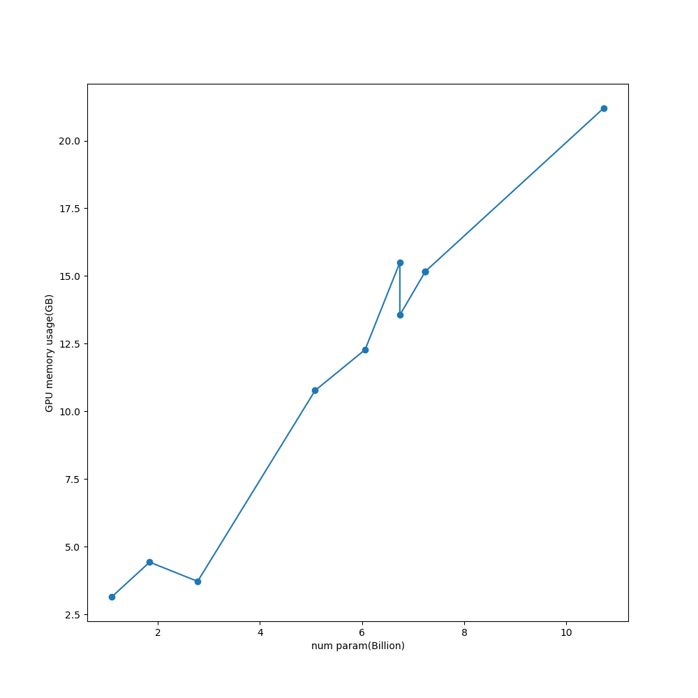

# LLMのモデルパラメータ数とGPUメモリ使用量について

## 1. この記事の目的  
最近は右も左もLLMという風潮  
ぜひ、自分のPCで使ってみたいと思ったが、パラメータ数◯Bという表記  
馴染みの無い（特に日本人には）単位で実際にどこまでのサイズが自分の
PCで実行できるか、分からず検証してみようと

## 2. GPUメモリ使用量について

- LLMのGPUメモリ使用量の計算方法  
推論に必要なメモリは大まかに  FP16の1パラメータ(2バイト)に対してパラメータ数◯Bとすると  
$必要なメモリ(GB) = 2 \times ◯$   
となります。意外とシンプルです。 [[1](#参考)]

- GPUメモリ使用量の実測  
GPUtil[[2](#参考)]を使用して次のコードで計測。

```python
import GPUtil
def get_gpu_used_memory(device_id):
    byte_gpu_used_memory = GPUtil.getGPUs()[device_id].memoryUsed
    GB_gpu_used_memory = byte_gpu_used_memory / 1024
    return GB_gpu_used_memory
```

## 3. モデル  

- 計測対象モデル
1. [TinyLlama-1.1B-Chat-v1.0](https://huggingface.co/TinyLlama/TinyLlama-1.1B-Chat-v1.0)
2. [phi-2](https://huggingface.co/microsoft/phi-2)
3. [Mistral-7B-v0.1](https://huggingface.co/mistralai/Mistral-7B-v0.1)
4. [zephyr-7b-beta](https://huggingface.co/HuggingFaceH4/zephyr-7b-beta)
5. [SOLAR-10.7B-Instruct-v1.0](https://huggingface.co/upstage/SOLAR-10.7B-Instruct-v1.0)  
6. [LLaMA-MoE-v1-3_5B-4_16](https://huggingface.co/llama-moe/LLaMA-MoE-v1-3_5B-4_16)  
7. [xglm-4.5B](https://huggingface.co/facebook/xglm-4.5B)  
8. [idefics-9b-instruct](https://huggingface.co/HuggingFaceM4/idefics-9b-instruct)
9. [Yi-6B](https://huggingface.co/01-ai/Yi-6B)
10. [Qwen-1_8B-Chat](https://huggingface.co/Qwen/Qwen-1_8B-Chat)

- パラメータ数の実測
torchinfo[[3](#参考)]を使用して、次のコードで計測。 

```python
from torchinfo import summary
def get_billion_param(model):
    billion = 1000**3
    return round(summary(model, verbose=0).total_params / billion, 2)
```

## 4. コードと結果
- コード全体  

```python
from torchinfo import summary
def get_billion_param(model):
    billion = 1000**3
    return round(summary(model, verbose=0).total_params / billion, 2)
```

ここ[[4](#参考)]にもおいています。

- 結果  

おおまかには  
[2. GPUメモリ使用量について](#2-GPUメモリ使用量について)
の通りになっています。  
ただし、いくらか誤差もありそうで内部で使用しているアルゴリズムの差もあるかもしれません。

## 5. まとめ

今後、モデルのファインチューニングをしてみたいと考えています。
モデルの全てのパラメータの再学習には  
$必要なメモリ(GB) = 4 \times ◯$   
が必要なよう[[3](#参考)]なので、phi-2くらいがローカルPCで使用できる最高ラインくらいになりそうですね。

## 6.参考
[1] https://discuss.huggingface.co/t/llama-7b-gpu-memory-requirement/34323/6  
[2] https://github.com/anderskm/gputil?tab=readme-ov-file  
[3] https://github.com/TylerYep/torchinfo  
[4] https://github.com/SoseSose/LLM-need-memory
